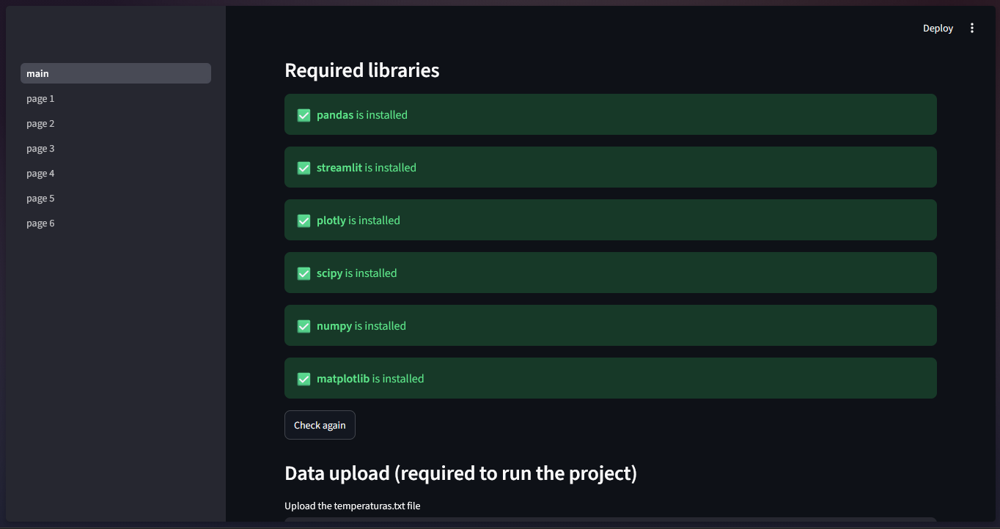
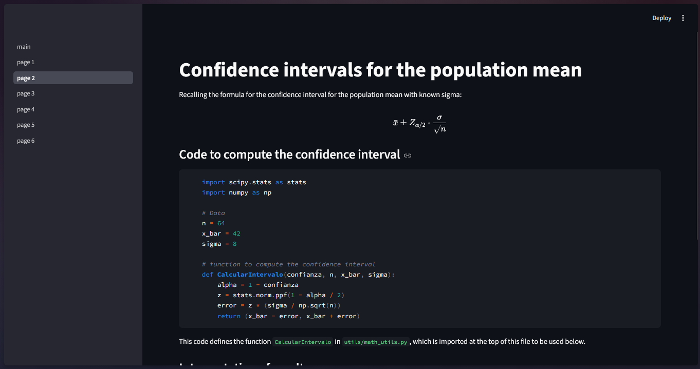
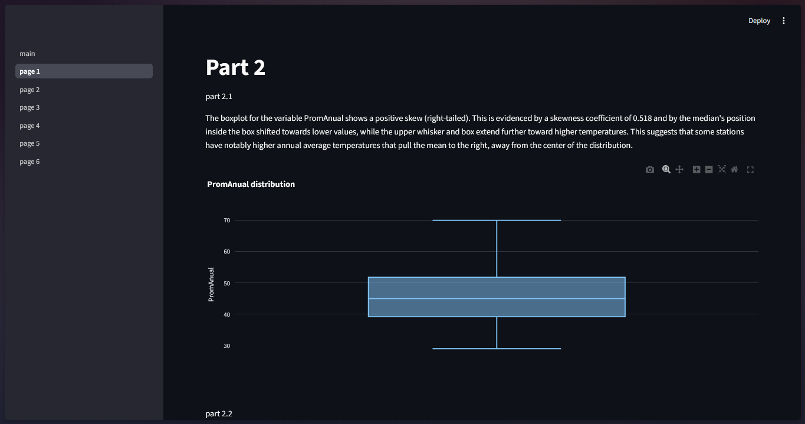

# 📊 Analytics Dashboard App - Temperature Analysis


[](https://analytics-dashboard-app.streamlit.app)

An interactive data visualization application designed to explore, analyze, and extract patterns from temperature records. This dashboard allows users to interact with the data through different views and dynamic filters.

## 👁️ Dashboard Overview








## 🛠️ Technologies Used

This project was developed using the following tech stack for data processing and the graphical interface:

*   **Python:** Main language for the project's logic.
*   **Streamlit:** Framework for creating the interactive web interface and modular pages.
*   **Pandas & NumPy:** Cleaning, manipulation, and structuring of the temperature dataset.
*   **Matplotlib / Seaborn:** Rendering of charts and statistical trends.

## 🚀 Installation and Local Usage

Follow these steps to run the project on your local machine:

1. **Clone the repository:**
   ```bash
   git clone [https://github.com/101Delgado/analytics-dashboard-app.git](https://github.com/101Delgado/analytics-dashboard-app.git)
   cd analytics-dashboard-app
